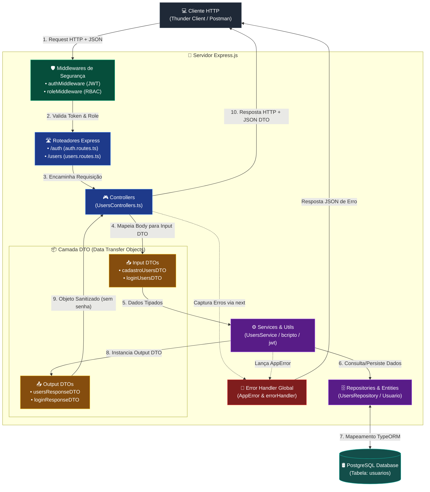

# 📚 Clinic Manager API 


---

# 📝 Sobre o Projeto

A **Clinic Manager API** é o back-end de um sistema de gerenciamento de clínica médica de pequeno porte. Este repositório contém a **Etapa de Autenticação e Autorização**: a base de acesso do sistema (cadastro de usuários, login com emissão de token JWT e controle de acesso baseado em perfis / RBAC).

Este projeto foi desenvolvido como parte avaliativa do curso de **Desenvolvimento Back-end com Node.js** (Módulo 02) do **SENAI (Programa SCTec)**.

---

# Tecnologias utilizadas

* **Linguagem:** TypeScript
* **Ambiente de Execução:** Node.js
* **Framework Web:** Express.js
* **ORM:** TypeORM
* **Banco de Dados:** PostgreSQL
* **Criptografia & Segurança:** Bcryptjs e JWT
* **Execução em Desenvolvimento:** ts-node-dev

---

# 🎯 Objetivo

Aplicar, na prática, os principais conceitos estudados, tais como:

- Programação Orientada a Objetos
- Arquitetura em Camadas MVC
- Banco de Dados Relacional
- SQL
- PostgreSQL
- Programação Assíncrona
- DTOs
- Classes
- Tratamento de Erros
- Clean Code, SOLID
- Git, GitHub, GitFlow

---

# 🚧 Status do Projeto

Funcionalidades de domínio da clínica (especialidades, médicos, pacientes e consultas) **não fazem parte desta entrega** e serão construídas em um projeto futuro sobre esta mesma base de código.

---

# 📋 Pré-requisitos

Antes de executar o projeto, certifique-se de possuir instalado em sua máquina:

- Node.js 20+
- npm
- PostgreSQL 14+
- Git
- Visual Studio Code (ou outra IDE compatível)

> O servidor PostgreSQL deve estar em execução, e o usuário informado nas variáveis de ambiente deve possuir permissão para criar bancos de dados.

---

# 🚀 Instalação

## 1. Clone o repositório

```bash
git clone https://github.com/VitorBecker/Clinic-API-SCTECH
```

Acesse a pasta do projeto:

```bash
cd "Clinic API"
```

---

## 2. Instale as dependências

Crie um banco de dados PostgreSQL (ex.: `clinicapi_db`)

> A tabela de usuários é criada automaticamente pelo TypeORM (`synchronize: true`, ativo no ambiente de desenvolvimento) ao subir a aplicação pela primeira vez.

---

## 3. Instale as dependências

```bash
npm install
```

> O comando acima instalará automaticamente todas as dependências definidas no arquivo `package.json`.

---

## 4. Configure as variáveis de ambiente

Crie um arquivo na raiz do projeto:

```text
.env
```

Copie para ele todo o conteúdo do arquivo abaixo e o altere com suas próprias informações:

```text
.env.example
```

   | Variável         | Descrição                                             |
   |------------------|-------------------------------------------------------|
   | `PORT`           | Porta em que a API vai escutar (ex.: `3000`)          |
   | `JWT_SECRET`     | Segredo usado para assinar/validar o token JWT        |
   | `JWT_EXPIRES_IN` | Tempo de expiração do token (ex.: `1d`)               |
   | `PG_HOST`        | Host do PostgreSQL                                    |
   | `PG_PORT`        | Porta do PostgreSQL (padrão `5432`)                   |
   | `PG_DATABASE`    | Nome do banco de dados                                |
   | `PG_USER`        | Usuário do PostgreSQL                                 |
   | `PG_PASSWORD`    | Senha do PostgreSQL                                   |

   A aplicação falha ao iniciar caso `JWT_SECRET` não esteja definido — isso é proposital, para nunca subir com um segredo previsível.

---

## 5. Execute a aplicação

### Ambiente de desenvolvimento:

Para executar diretamente o código TypeScript:

```bash
npm run dev
```

### Aplicação compilada

Primeiro, compile o projeto:

```bash
npm run build
```

Depois, execute a versão compilada:

```bash
npm run start
```

> A API sobe em `http://localhost:<PORT>`.

---

# 🌿 Versionamento

O projeto utiliza um fluxo de versionamento inspirado no **GitFlow**, adaptado às necessidades da equipe e aos requisitos acadêmicos do projeto.

## Branches

```text
main
develop
docs/readme
feat/auth
feat/rbac
feat/refactor-perfis-e-dto
refactor/rotas-modularizadas
```

> Cada funcionalidade é desenvolvida em uma **branch**, criada a partir da `develop`, sendo realizados commits com posterior mergeamento. No final do desenvolvimento, houve o mergeamento para a branch `main`.


---

# 📂 Arquitetura do projeto e estrutura de pastas

Arquitetura MVC em camadas, já preparada para receber os módulos de domínio da clínica nas próximas etapas:

```
└── Clinic API SCTEC/                 # Pasta raiz do projeto
    │
    ├── .github/                                   # Configurações do repositório no GitHub
    │   └── CODEOWNERS                             # Define responsáveis pelo código
    │
    ├── src/
    │   ├── controllers/        # Recebe a requisição HTTP, aciona o service, devolve a resposta
    │   ├── database/            # Script de criação de tabela
    │   ├── dtos/                 # Formatos de entrada e saída da API (Data Transfer Objects)
    │   ├── entities/              # Entidades TypeORM (tabelas do banco)
    │   ├── errors/                 # Classe de erro de aplicação (AppError)
    │   ├── middlewares/             # Autenticação (JWT), autorização (RBAC) e tratamento de erros
    │   ├── repositories/             # Única camada que conversa com o TypeORM/PostgreSQL
    │   ├── routes/                    # Definição dos endpoints e associação com os controllers
    │   ├── services/                   # Regras de negócio (validações, orquestração)
    │   └── utils/                       # Funções auxiliares (hash de senha, geração/validação de JWT)
    │
    ├── data-source.ts                    # Configuração da conexão com o PostgreSQL (TypeORM)
    ├── server.ts                          # Inicialização do Express e registro de rotas/middlewares
    ├── .env.example                        # Modelo das variáveis de ambiente
    ├── .gitignore                           # Arquivos e diretórios ignorados pelo Git
    ├── package.json                          # Dependências e scripts do projeto
    ├── package-lock.json                      # Versões exatas das dependências
    ├── tsconfig.json                           # Configuração do compilador TypeScript
    └── README.md                                # Documentação do projeto
```


## 🔄 Fluxo de execução da aplicação




## Perfis de acesso disponíveis

| Perfil          | Descrição                                            |
|-----------------|------------------------------------------------------|
| `ADMINISTRADOR` | Acesso completo às funcionalidades da API            |
| `ATENDENTE`     | Acesso operacional, com permissões restritas (padrão)|


## Documentação dos endpoints

### POST /auth/register

Cadastra um novo usuário. Público.

**Body:**
```json
{
  "nome": "Ana Souza",
  "email": "ana@medclinic.com",
  "senha": "senha123",
  "role": "ATENDENTE"
}
```
`role` é opcional — se omitido, o usuário é criado como `ATENDENTE`.

**Resposta — 201 Created**
```json
{
  "id": "b3f1c2a0-...",
  "nome": "Ana Souza",
  "email": "ana@medclinic.com",
  "role": "ATENDENTE",
  "criadoEm": "2026-09-14T12:00:00.000Z"
}
```

**Erros:** `400` (campo obrigatório ausente) · `409` (e-mail já cadastrado)

---

### POST /auth/login

Autentica um usuário e retorna o token JWT. Público.

**Body:**
```json
{
  "email": "ana@medclinic.com",
  "senha": "senha123"
}
```

**Resposta — 200 OK**
```json
{
  "token": "eyJhbGciOiJIUzI1NiIs..."
}
```

**Erros:** `401` (e-mail ou senha inválidos)

---

### GET /users/me

Retorna os dados do usuário autenticado. Requer token válido.

**Header:** `Authorization: Bearer <token>`

**Resposta — 200 OK**
```json
{
  "id": "b3f1c2a0-...",
  "nome": "Ana Souza",
  "email": "ana@medclinic.com",
  "role": "ATENDENTE",
  "criadoEm": "2026-09-14T12:00:00.000Z"
}
```

**Erros:** `401` (token ausente, inválido ou expirado)

---

### GET /users/admin

Endpoint restrito ao perfil `ADMINISTRADOR`, usado para demonstrar o RBAC.
Requer token válido de um usuário `ADMINISTRADOR`.

**Header:** `Authorization: Bearer <token>`

**Resposta — 200 OK**
```json
{
  "mensagem": "Acesso ao painel administrativo concedido",
  "usuarioLogado": { "id": "b3f1c2a0-...", "role": "ADMINISTRADOR" }
}
```

**Erros:** `401` (não autenticado) · `403` (autenticado, mas sem o perfil `ADMINISTRADOR`)
-- 

---

# 👥 DEV 

- Vítor Olegário Becker de Aquino

---

# 📄 Licença

Projeto desenvolvido exclusivamente para fins acadêmicos.

---
